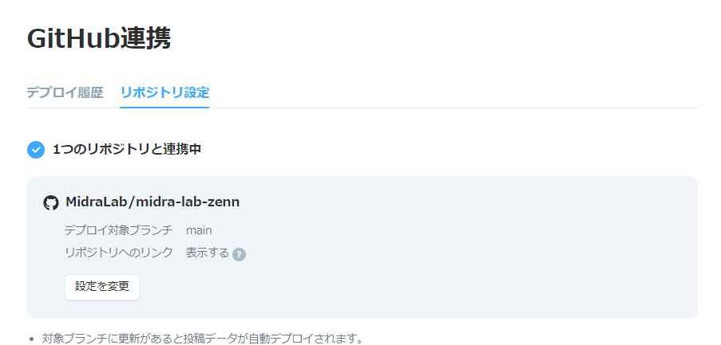

# midra-lab-zenn

MiraLab用のZennの記事作成ドキュメント

<!-- START doctoc -->
<!-- END doctoc -->

# 使い方

## 準備

1. [Docker](https://www.docker.com/)のインストール
2. [Zenn](https://zenn.dev/)のアカウントを作成する
3. Repositoryをforkする
4. 以下の画像のようにZennの[GitHub連携](https://zenn.dev/dashboard/deploys?tab=repo_settings)
   にて[midra-lab-zenn](https://github.com/MidraLab/midra-lab-zenn)との連携及びデプロイ対象ブランチを `main` に設定する

## 新規記事の作成

1. ターミナル上で `docker compose up -d --build` を実行
2. ターミナル上で `docker exec midra-lab-zenn zenn new:article --publication-name midra_lab bash` を実行する
3. `articles`内に新しく生成されたファイルに記事を書いていく
4. 画像は`images`フォルダにその記事の名前のフォルダを作成して入れる。

## 記事のPreview

1. ブラウザで http://localhost:8000/ にアクセスをする
2. 任意のページをクリックして、記事を確認する

## 記事の公開

1. 記事の作成が完了したら、`published:` を trueに変更する
2. リモートブランチにpushする

## 記事の削除

安全のため、コンテンツの削除は[ダッシュボードの投稿管理](https://zenn.dev/dashboard)からのみ行うことができます。

# 参考サイト

* [Zenn CLIで記事・本を管理する方法](https://zenn.dev/zenn/articles/zenn-cli-guide)
